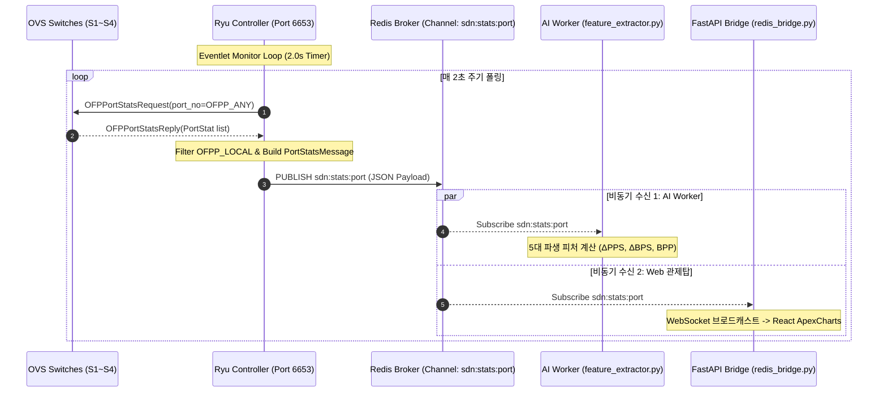

# 📘 [Tech Lead] 6주차 구현 계획서 — 2-Tier 텔레메트리 파이프라인 및 Redis 포트 통계 발행 (`ryu/app/controller.py`)

> **담당자:** 박시현 (22101489 / Tech Lead & 시스템 아키텍트)  
> **해당 기간:** 6주차 (2026.10.05 ~ 2026.10.11)  
> **상위 근거 문서:** [`schedule_and_milestones.md`](../../../planning/schedule_and_milestones.md), [`roadmap_v2.md`](../../../planning/roadmap_v2.md), [`sdn_events.py`](../../../../harness/contracts/sdn_events.py), [`phase2_core_sdn_infra.md`](../../../guides/dev_a_tech_lead/phase2_core_sdn_infra.md)

---

## 1. 목적 및 배경

5주차에 구축된 OpenFlow 1.3 L2/L3 스위칭과 다이아몬드 무루프 포워딩([`ryu/app/controller.py`](../../../../ryu/app/controller.py))을 통해 4대 스위치(S1~S4) 간 무유실 데이터 전송 기반이 확립되었습니다. 

6주차의 핵심 과제는 제어 평면(Ryu)이 가상 네트워크의 실시간 트래픽 상태를 주기적으로 수집하여 외부 분석 시스템으로 전달하는 **2-Tier 텔레메트리 수집 파이프라인**을 가동하는 것입니다.

* **문제 인식:** Ryu 내부에서 직접 ML 이상 탐지 모델을 추론하면 Greenlet 코루틴 루프가 블로킹되어 OVS 연결이 끊어지는 구조적 결함이 발생합니다.
* **해결 방향:** Ryu는 **비차단 2초 주기 포트 통계 수집 및 발행(Publish)**만을 전담하고, 독립된 Python 3.10 프로세스(유재민의 `feature_extractor.py`) 및 관제탑 백엔드(김관우의 `api/redis_bridge.py`)로 데이터를 실시간 브로드캐스팅합니다.

---

## 2. 요구사항 정의 (Definition of Done, DoD)

| # | 요구사항 항목 | 상세 내용 | 검증 기준 |
|:---:|:---|:---|:---|
| **R1** | **Datapath 동적 추적** | 스위치 연결(`EventOFPStateChange`) 및 해제 시 활성 데이터패스 맵(`self.datapaths`) 자동 갱신 | S1~S4 연결/단절 시 맵 상태 100% 동기화 |
| **R2** | **비차단 2초 주기 폴링** | Eventlet 비차단 그린스레드(`hub.spawn`)를 활용하여 2초 주기로 활성 스위치 전체에 `OFPPortStatsRequest` 발송 | Echo Heartbeat 지연 없이 2.0초 간격 폴링 유지 |
| **R3** | **포트 통계 파싱 & 필터링** | `EventOFPPortStatsReply` 수신 시 패킷/바이트/오류 누적 통계 파싱 (로컬 가상 포트 `OFPP_LOCAL` 제외) | 유효 물리/트렁크 포트(1~4) 통계만 정밀 추출 |
| **R4** | **Pydantic SSOT 계약 준수** | [`sdn_events.py`](../../../../harness/contracts/sdn_events.py)의 `PortStatsMessage` 규격과 100% 일치하는 JSON 페이로드 생성 | Pydantic v2 유효성 검증 오류 0건 |
| **R5** | **Redis 비동기 발행 & 장애 격리** | Redis `sdn:stats:port` 채널로 직렬화 발행. Redis 다운 시에도 컨트롤러 스위칭 기능 무중단 보장 | Redis 재연결 백오프 및 예외 격리 확인 |
| **R6** | **단위 테스트 및 회귀 통과** | 호스트 Python 3.10 환경에서 텔레메트리 생성/발행 로직을 검증하는 테스트 추가 및 회귀 통과 | `pytest` 통과율 100% 및 flake8/mypy 0건 |

---

## 3. 상세 아키텍처 및 파이프라인 설계

### 3.1 2-Tier 텔레메트리 데이터 파이프라인 흐름도



### 3.2 Datapath 생명주기 및 모니터링 루프 (`_monitor_loop`)

```python
# ryu/app/controller.py 추가 설계
def _monitor_loop(self):
    while True:
        hub.sleep(2.0)
        for dp in list(self.datapaths.values()):
            self._request_stats(dp)

def _request_stats(self, datapath):
    parser = datapath.ofproto_parser
    ofproto = datapath.ofproto
    # 모든 활성 포트에 대한 포트 통계 요청 (OFPP_ANY)
    req = parser.OFPPortStatsRequest(datapath, 0, ofproto.OFPP_ANY)
    datapath.send_msg(req)
```

### 3.3 `OFPPortStatsReply` 파싱 및 페이로드 스펙

* **제외 대상:** `stat.port_no > ofproto.OFPP_MAX` (예: `OFPP_LOCAL` = `0xfffffffe`)
* **추출 필드 매핑표:**

| Pydantic 모델 필드 | Ryu `OFPPortStats` 속성 | 설명 |
|:---|:---|:---|
| `dpid` | `datapath.id` | 스위치 DPID (1~4) |
| `port_no` | `stat.port_no` | 스위치 물리 포트 번호 (1~4) |
| `rx_packets` | `stat.rx_packets` | 수신 누적 패킷 수 |
| `tx_packets` | `stat.tx_packets` | 송신 누적 패킷 수 |
| `rx_bytes` | `stat.rx_bytes` | 수신 누적 바이트 수 |
| `tx_bytes` | `stat.tx_bytes` | 송신 누적 바이트 수 |
| `rx_errors` | `stat.rx_errors` | 수신 에러 수 (기본 0) |
| `duration_sec` | `stat.duration_sec` | 활성 지속 시간 (초) |

### 3.4 Redis 장애 격리 (Fault Tolerance) 가드레일

* Redis 통신 장애 시 Greenlet 예외가 전체 Ryu 애플리케이션으로 전파되어 스위칭 루프가 중단되는 것을 원천 방지합니다.
* `redis.Redis(host=..., port=6379, socket_timeout=1.0)` 설정 및 `publish()` 호출부를 `try-except redis.RedisError` 블록으로 격리합니다.
* Redis 연결 실패 시 Warning 로그만 남기고 다음 주기에 재연결을 시도합니다.

---

## 4. 일자별 실행 계획 (6주차, 10.05 ~ 10.11)

| 일자 | 작업 내용 | 담당자 & 협업 | 체크포인트 |
|:---:|:---|:---|:---|
| **10.05 (월)** | Datapath 동적 관리 및 Eventlet 백그라운드 루프 | 박시현 (Tech Lead) | • `MAIN_DISPATCHER` 진입 시 `datapaths` 딕셔너리 등록<br>• `DEAD_DISPATCHER` 단절 시 안전 제거 |
| **10.06 (화)** | `OFPPortStatsRequest` 발송 & `OFPPortStatsReply` 파서 | 박시현 (Tech Lead) | • 2초 주기 `OFPPortStatsRequest` 발송 확인<br>• `OFPP_LOCAL` 필터링 및 포트별 통계 파싱 |
| **10.07 (수)** | Redis `sdn:stats:port` 연동 & JSON 직렬화 | 박시현 (Tech Lead) | • Pydantic 계약 모델 규격 100% 일치 직렬화<br>• Redis Pub/Sub 발행 및 CLI 모니터링 확인 |
| **10.08 (목)** | Redis 장애 격리 가드레일 및 예외 복원력 강화 | 박시현 (Tech Lead) | • Redis 다운 시 스위칭 정상 동작 확인<br>• 재접속 백오프 정상 복구 검증 |
| **10.09 (금)** | 단위 테스트 스위트 작성 & 정적 분석 | 박시현 (Tech Lead) | • `tests/ryu/test_telemetry.py` 작성<br>• pytest 100% 통과, mypy/flake8 0건 검증 |
| **10.10 (토)** | AI 피처 추출기 및 관제탑 웹 E2E 연동 점검 | 박시현 + 유재민 + 김관우 | • `feature_extractor.py` 구독 실시간 피처 계산 확인<br>• React 관제탑 차트에 실시간 텔레메트리 스트리밍 확인 |
| **10.11 (일)** | 6주차 마일스톤 완료 평가 & 주간보고서 #3 감수 | 전원 (김관우 총괄) | • 6주차 DoD 전 항목 달성 확인<br>• 주간 진도 보고서 #3 최종 마감 |

---

## 5. 검증 및 테스트 시나리오

### TC-1: 스위치 연결 시 Datapath 등록 및 해제 검증
* **절차:** S1~S4 순차 연결 및 단절 시뮬레이션.
* **합격 기준:** `self.datapaths`에 4대 스위치가 정확히 등록되고 단절 시 메모리 누수 없이 삭제됨.

### TC-2: 2초 주기 `OFPPortStatsRequest` 발송 타이밍 검증
* **절차:** 10초간 컨트롤러 구동 후 발송된 요청 메시지 수 측정.
* **합격 기준:** 스위치당 5회(±1회 허용 오차)의 통계 요청이 누락 없이 발송됨.

### TC-3: `sdn:stats:port` 발행 메시지의 Pydantic SSOT 정합성 검증
* **절차:** Redis CLI에서 `SUBSCRIBE sdn:stats:port`를 실행하고 수신된 JSON을 [`sdn_events.py`](../../../../harness/contracts/sdn_events.py)의 `PortStatsMessage`로 역직렬화.
* **합격 기준:** Pydantic `ValidationError` 0건, 타임스탬프 및 DPID, 포트 통계 리스트 정상 수신.

### TC-4: Redis 통신 단절 시 SDN 스위칭 무중단 검증
* **절차:** Mininet 정상 통신(`pingall`) 도중 `docker stop sdn-redis` 실행.
* **합격 기준:** Ryu 컨트롤러 프로세스가 다운되지 않고 경고 로그만 남기며, `pingall` 통신 성공률 100%가 유지됨.

---

## 6. 잠재적 리스크 및 완화 방안 (Risk & Mitigation)

1. **Ryu의 Eventlet과 동기식 Redis 라이브러리 간 블로킹 위험:**
   * *리스크:* `redis-py` 클라이언트의 소켓 I/O가 Eventlet 루프를 블로킹하여 OVS Echo Request에 응답하지 못할 위험.
   * *대응:* `eventlet.monkey_patch()`가 적용된 상태에서 타임아웃을 `socket_timeout=0.5`로 극단적으로 짧게 제한하고, 경량 소켓 모드로 동작하도록 구성.
2. **다수 스위치에 대한 동시 요청 시 트래픽 버스트:**
   * *리스크:* S1~S4에 동시에 통계 요청을 보낼 경우 컨트롤러 큐에 Reply 버스트가 집중될 위험.
   * *대응:* 스위치별 요청 루프 사이에 `hub.sleep(0.01)` 미세 지연을 두어 Packet-In 큐의 지터(Jitter) 분산.
3. **카운터 래핑(Wrap-around) 및 재부팅 리셋:**
   * *리스크:* 32비트/64비트 정수 오버플로우 또는 링크 재연결 시 누적 카운터가 0으로 초기화되어 피처가 왜곡될 위험.
   * *대응:* 6주차 피처 추출기(`feature_extractor.py`)에서 음수 델타($\Delta < 0$) 발생 시 0으로 보정하는 필터 가드레일 설계.
